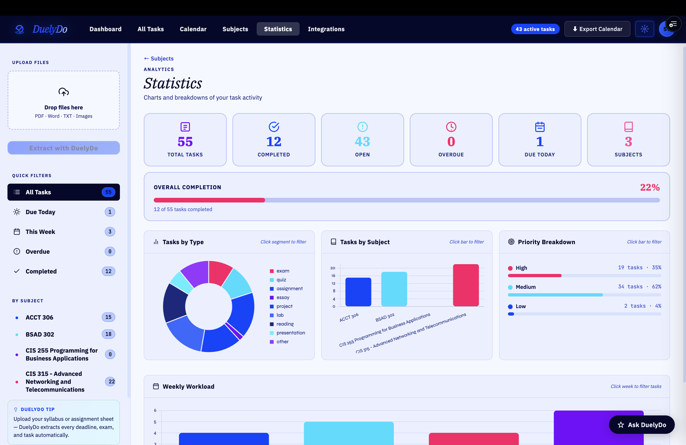

# DuelyDo

> An AI system that converts unstructured academic content into executable workflows — instantly.

**Repository Notice**  
This repository represents DuelyDo’s system design, features, and architecture.  
The full production system — including backend services and proprietary processing logic — is maintained in a private repository for security, scalability, and deployment.

  

## Overview

DuelyDo is not a task manager.

It is an academic interpretation and execution system that transforms unstructured inputs — such as syllabi, course documents, emails, and images — into a structured, prioritized workflow.

Instead of requiring manual organization, DuelyDo identifies, structures, and sequences academic work automatically.

---

## Problem

Academic workflows are fragmented:

- deadlines are buried in documents  
- expectations are distributed across platforms  
- planning is manual and error-prone  

Students are expected to act on information that is not immediately actionable.

DuelyDo converts that information into execution-ready tasks.

---

## Core Capabilities

### Input Interpretation
Processes:
- PDF (syllabi, course outlines)  
- DOCX documents  
- images (screenshots, scans)  
- plain text and email  

Extracts assignments, exams, quizzes, deadlines, and multi-step tasks.

---

### Task Structuring
Normalizes extracted data into:
- timestamped task objects  
- priority levels  
- course associations  

---

### Workflow Generation
Builds:
- prioritized task queues  
- course-based organization  
- time-aware scheduling  

---

### AI Layer
A conversational interface that:
- uses real academic context  
- generates plans based on deadlines  
- assists with prioritization  

---

### Execution Interface
Enables:
- task tracking  
- completion management  
- workload visibility  

---

## System Flow

1. Ingest — upload input  
2. Interpret — extract structured data  
3. Transform — generate tasks and priorities  
4. Execute — manage through the interface  

---

## Architecture

Client Input (PDF / DOCX / Image / Text)  
↓  
Parsing Layer (PDF.js / Mammoth.js)  
↓  
Preprocessing (Normalization)  
↓  
Backend Processing Layer (Python)  
↓  
AI Processing (Claude API)  
↓  
Task Structuring Engine  
↓  
Supabase (Storage + Sync)  
↓  
Frontend Application  

---

## Engineering Challenges

- Handling inconsistent academic formats  
- Interpreting ambiguous time expressions (e.g., "Week 5", "next Friday")  
- Managing incomplete or missing deadline data  
- Designing a normalized schema from unstructured input  
- Integrating AI processing within a Python backend pipeline  
- Maintaining UI responsiveness during asynchronous processing  

---

## Performance

- Near real-time processing of multi-page documents  
- Supports PDF, DOCX, image, and text inputs  
- Extracts dozens of tasks per document  
- Optimized for fast UI updates  

---

## Tech Stack

| Layer | Technology |
|------|-----------|
| Frontend | React, HTML, CSS, JavaScript |
| Backend | Python (FastAPI)|
| AI | Anthropic Claude API|
| Database | Supabase (PostgreSQL)|
| Parsing | PDF.js, Mammoth.js |
| Visualization | Chart.js |

---

## Interface Preview

| Dashboard | Calendar | Analytics |
|----------|----------|-----------|
|  |  |  |

---

## Demo

https://duelydo.app (coming soon)

---

## Roadmap

- Mobile apps (iOS / Android)  
- LMS integrations (Canvas, Blackboard, Moodle)  
- OCR for scanned documents  
- Calendar sync (Google / Apple)  
- Collaborative features  

---

## Contributing

Open to contributions and improvements via issues or pull requests.

---

## License

MIT License © DuelyDo
