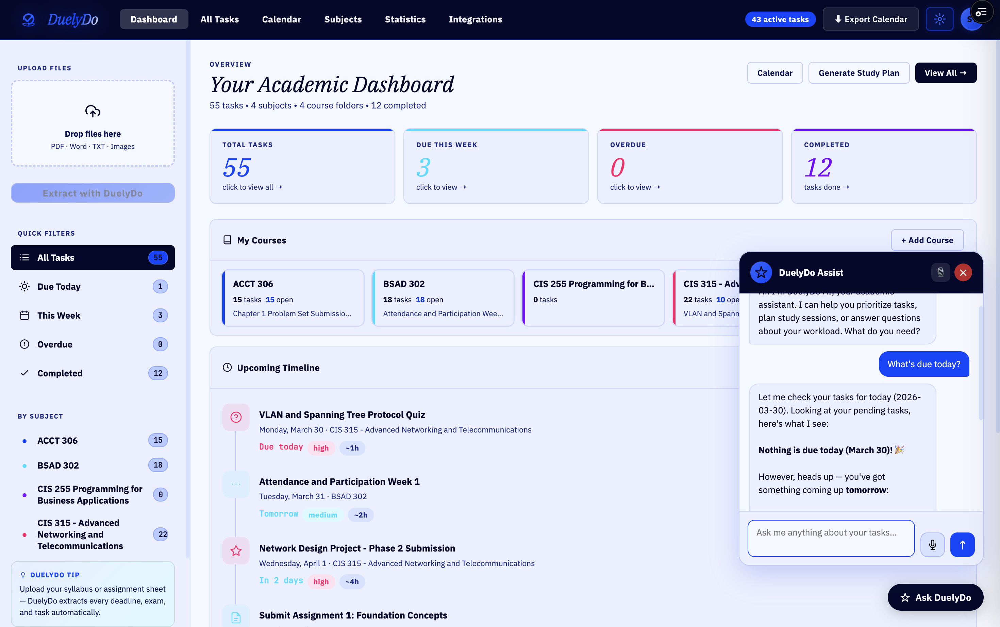
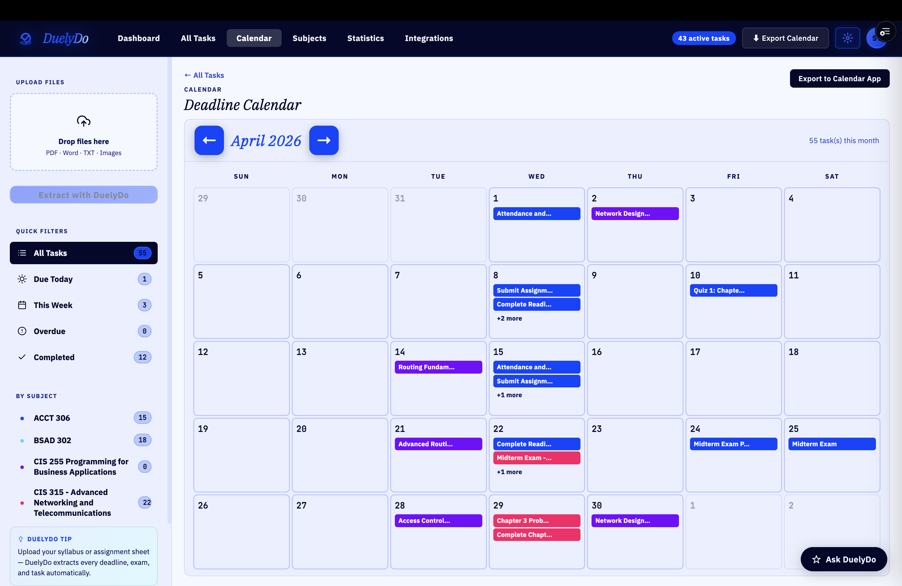

# DuelyDo — AI-Powered Academic Task Manager

[](https://github.com/stanleytarun777/DuelyDo_Public_Showcase)

DuelyDo automatically extracts assignments, exams, and deadlines from course documents using the Claude API, and organizes them into a structured task dashboard — so students spend time on work, not on finding it.

---

## Screenshots

| Dashboard | Calendar | Analytics |
|-----------|----------|-----------|
|  |  |  |

---

## Tech Stack

| Layer | Technology |
|-------|------------|
| Frontend | React 18 + Vite |
| Backend | FastAPI · Python 3.12 |
| AI | Anthropic Claude API |
| Database & Auth | Supabase (PostgreSQL) |
| Document Parsing | pypdf · python-docx |
| Deployment | Docker · Docker Compose · Nginx |

---

## Architecture

```
User → React Frontend (Vite + Nginx)
          ↓  POST /api/extract  (multipart upload)
       FastAPI Backend (Python 3.12)
          ↓  Anthropic Messages API
       Claude → structured JSON tasks
          ↓
       Supabase — auth + PostgreSQL persistence
```

---

## Project Structure

```
DuelyDo_Public_Showcase/
├── Frontend/
│   ├── src/
│   │   ├── Components/       FileUpload, FolderGrid, TaskTable, StatsGrid, ...
│   │   ├── Utils/            task normalization, date helpers
│   │   └── App.jsx           state management + layout
│   ├── Dockerfile            multi-stage: Node build → Nginx serve
│   ├── nginx.conf            SPA routing + /api proxy to backend
│   └── package.json
├── Backend/
│   ├── App/
│   │   ├── main.py           FastAPI routes (/api/health, /api/extract)
│   │   ├── models.py         Pydantic request/response schemas
│   │   ├── config.py         environment settings via pydantic-settings
│   │   └── services/
│   │       ├── anthropic_service.py   AI extraction (stub)
│   │       └── file_parser.py         multi-format file reader (stub)
│   ├── Dockerfile
│   └── requirements.txt
├── Images/                   app screenshots
└── docker-compose.yml        orchestrates frontend (8080) + backend (8000)
```

---

## Getting Started

```bash
# 1. Clone
git clone https://github.com/stanleytarun777/DuelyDo_Public_Showcase.git
cd DuelyDo_Public_Showcase

# 2. Configure environment
cp Backend/.env.example Backend/.env
# Open Backend/.env and add your ANTHROPIC_API_KEY

# 3. Run with Docker
docker compose up --build
```

| Service | URL |
|---------|-----|
| Frontend | http://localhost:8080 |
| Backend API | http://localhost:8000 |
| Health check | http://localhost:8000/api/health |

---

## API Reference

### `GET /api/health`
Returns service status and active model.

```json
{ "status": "ok", "model": "claude-sonnet-4-20250514" }
```

### `POST /api/extract`
Accepts one or more course files (PDF, DOCX, TXT, CSV, MD) and returns extracted tasks.

```json
{
  "tasks": [
    {
      "title": "Midterm Exam",
      "subject": "COMP 3400",
      "dueDate": "2025-10-15",
      "priority": "high",
      "type": "exam",
      "status": "todo"
    }
  ]
}
```

---

## Repository Notice

This public showcase demonstrates the system architecture and frontend implementation. Core AI extraction logic and deployment configurations are maintained in a private repository.

---

**License:** MIT © DuelyDo
